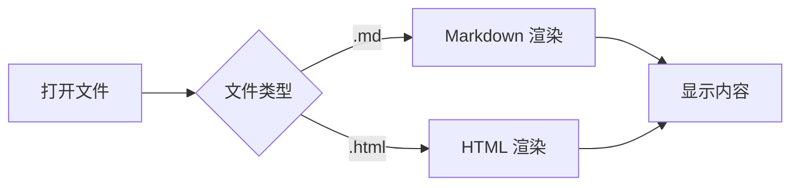

# 测试 Markdown

## 代码高亮

```javascript
function hello() {
  console.log("Hello, MD Reader!");
}
```

## 数学公式

行内公式：$E = mc^2$

块级公式：
$$\int_{-\infty}^{\infty} e^{-x^2} dx = \sqrt{\pi}$$

## 表格

| 功能 | 状态 |
|------|------|
| Markdown 渲染 | ✅ |
| 代码高亮 | ✅ |
| KaTeX | ✅ |
| Mermaid | ✅ |

## 任务列表

- [x] 离线化 JS 库
- [x] 构建成功
- [ ] 真机测试

## Mermaid 图表



> 这是一个引用块测试
